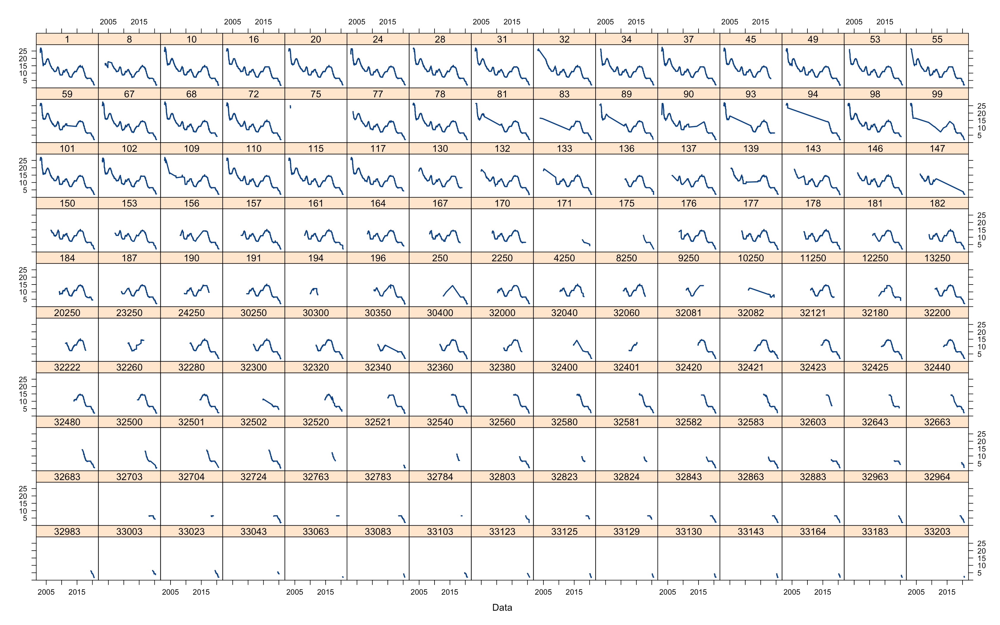
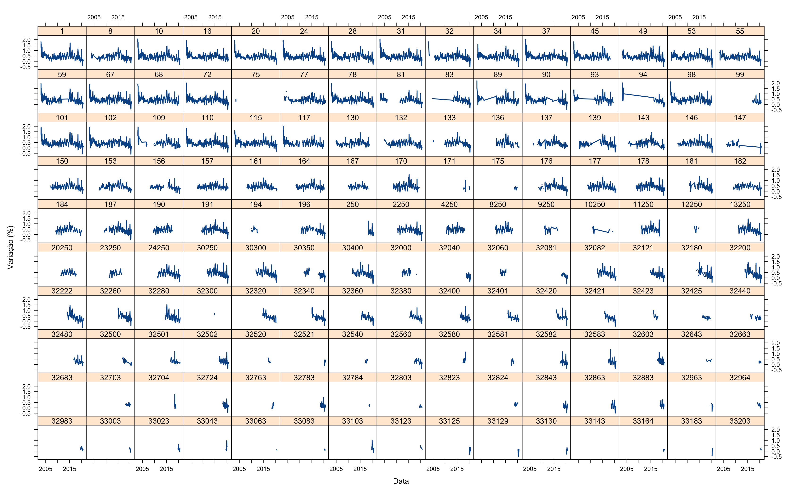

# Metodologia

Para a análise da reação das instituições frente às surpresas de política monetária, foram utilizados os microdados do Relatório de Mercado Focus (disponíveis em [Boletim Focus](https://www.bcb.gov.br/publicacoes/focus)), onde cada seção transversal semanal fornece uma amostra representativa das instituições. O Bacen realiza, semanalmente, uma pesquisa com a projeção de cerca de 150 instituições financeiras com as principais estatísticas do cenário econômico. O Boletim Focus também destaca as cinco empresas que mais acertam em suas projeções. Toda segunda-feira ele é publicado no site oficial do Bacen com um compilado dos indicadores macroeconômicos mais importantes para a economia. Entre os indicadores analisados estão o IPCA, o IGP-M, a taxa de câmbio, a taxa de crescimento do PIB e a taxa Selic. 

Os indicadores são compilados na sexta-feira anterior à publicação a partir de informações repassadas pelos principais bancos, agentes econômicos e instituições financeiras. As expectativas projetadas para o fechamento daquele ano são reunidas durante a semana e compiladas na sexta-feira. Os dados no relatório costumam ser apresentados em forma de tabela e em formato de gráfico. A tabela traz o comportamento dos indicadores na data de publicação do relatório, da semana anterior e do último mês. 

O Boletim Focus é divulgado às 08:00 de todas as segundas-feiras do ano no site oficial do Banco Central do Brasil. Na primeira página, encontramos uma tabela anual intitulada “Mediana – Agregado”. Isso significa que os números na tabela são a mediana de todos os agentes consultados pelo Bacen que fazem esse tipo de projeção. As sessões mostram a expectativa para o ano vigente e para os próximos três anos. As três primeiras colunas da tabela mostram, respectivamente, a expectativa do comportamento dos indicadores no dia da publicação, na semana anterior e no último mês (quatro semanas antes).

O Boletim Focus divulga as projeções individuais informadas pelos participantes que autorizaram a divulgação de seus microdados, com o objetivo de fomentar o desenvolvimento de pesquisas macroeconômicas de painel. Os dados compreendem todo o período em que foram informados ao Sistema Expectativas de Mercado, até um ano antes da data de divulgação. Não há identificação das instituições provedoras das informações, cujos nomes foram substituídos por códigos numéricos. 

## Especificação dos dados utilizados

Para atender aos propósitos deste ensaio, utilizaremos os microdados do Boletim Focus, contendo o código identificador da instituição, o indicador projetado, a data onde a projeção foi realizada, o mês de referência dessa projeção, a data da reunião do Copom correspondente à projeção e a meta da taxa Selic definida na reunião. Usamos as projeções anualizadas, ou seja, a projeção realizada no mês $t$ refere-se ao ano corrente daquele mês. Utilizaremos as projeções das seguintes variáveis:

| Variável                             | Abreviação | Período                            |
| ------------------------------------ | ---------- | ---------------------------------- |
| Taxa básica de juros                 | $selic$    | janeiro de 2003 a dezembro de 2020 |
| Taxa nominal de câmbio               | $cambio$   | janeiro de 2003 a dezembro de 2020 |
| Índice de Preços ao Consumidor Amplo | $ipca$     | janeiro de 2003 a dezembro de 2020 |

Com essa amostra é possível verificar, por instituição, se suas projeções são modificadas com uma surpresa de política monetária. Diferente de outros ensaios presentes na literatura, conseguimos ver, por cada instituição, historicamente, como suas projeções são modificadas com uma surpresa de política monetária. 

Visto que, na literatura, outros trabalhos buscam verificar como uma surpresa de política monetária impacta o mercado de capitais ou as taxas de juros de mercado e utilizam-se de medidas de tendência central, como a média de fim de período ou, mais comumente, a mediana, com essa amostra de dados, será possível verificar como as instituições alteram, historicamente, suas projeções quando ocorre uma surpresa de política monetária.

Para atingir os objetivos deste trabalho, utilizaremos a base de microdados em painel, visto que  modelo de regressão com dados em painel possui uma característica especial: se constitui de uma dimensão *temporal* e outra *espacial*. Isto porque a mesma unidade de corte transversal é acompanhada ao longo do tempo. Outras vantagens, conforme Hsiao (1986), é que os modelos para dados em painel, em relação aos modelos de corte transversal ou de séries temporais, controlam a heterogeinedade presente nos indivíduos e permitem o uso de mais observações, aumentando o número de graus de liberdade e diminuindo a colinearidade entre as variáveis explicativas.

### Taxa básica de juros - Selic

A meta da Selic é a taxa básica de juros da economia definida a cada 45 dias. É o principal instrumento de política monetária utilizado pelo Bacen para controlar a inflação. Ela influencia todas as taxas de juros do país, como as taxas de juros dos empréstimos, dos financiamentos e das aplicações financeiras. A taxa Selic refere-se à taxa de juros apurada nas operações de empréstimos de um dia entre as instituições financeiras que utilizam títulos públicos federais como garantia. O Bacen opera no mercado de títulos públicos para que a taxa Selic efetiva esteja em linha com a meta da Selic definida na reunião do Copom.

O nome da taxa Selic vem da sigla do Sistema Especial de Liquidação e de Custódia. Trata-se de uma infraestrutura do mercado financeiro administrada pelo Bacen. Nele são negociados títulos públicos federais. A taxa média ajustada dos financiamentos diários apurados nesse sistema corresponde à taxa Selic. As infraestruturas do mercado financeiro como um todo desempenham um papel fundamental no âmbito do SFN. Seu funcionamento adequado é essencial para a estabilidade financeira e condição necessária para salvaguardar os canais de transmissão da política monetária. 

O sistema Selic é fundamental em possíveis casos de falência ou insolvência de instituições financeiras. A liquidação em tempo real e o registro das transações com títulos públicos federais em seu banco de dados pode coibir fraudes e prevenir o contágio em outras instituições. Esta série será utilizada como base para o cálculo da surpresa de política monetária.

Na Figura 1 é possível verificar o histórico de projeções da Selic de cada uma das 150 instituições participantes do Boletim Focus. Naturalmente, todas tem um viés descendente, dado que a Meta Selic teve uma considerável queda ao longo das últimas duas décadas.

### Taxa nominal de câmbio

Taxa de câmbio nominal é a taxa que expressa a relação de valor entre duas moedas de países diferentes. Outra forma de defini-la é como o custo de uma moeda em relação a outra. Por definição, a taxa nominal são os numerais expressos diretamente como taxa de câmbio, que são as divulgadas pelas casas de câmbio.

As taxas de câmbio entre as diversas moedas variam a todo instante. Essas variações são denominadas de apreciação nominais ou depreciação nominais. A apreciação de uma moeda domestica é o aumento do seu preço em relação à outra estrangeira e a depreciação, de maneira inversa, significa que o preço da moeda nacional em relação à estrangeira esta caindo.

Na Figura 2 temos o histórico das projeções de câmbio das 150 instituições participantes do Boletim Focus.

### Índice de Preços ao Consumidor Amplo - IPCA

O Sistema Nacional de Índices de Preços ao Consumidor (SNIPC) consiste em uma combinação de processos destinados a produzir índices de preços ao consumidor. O objetivo é acompanhar a variação de preços de um conjunto de produtos e serviços consumidos pelas famílias.

O sistema abrange as regiões metropolitanas do Rio de Janeiro, Porto Alegre, Belo Horizonte, Recife, São Paulo, Belém, Fortaleza, Salvador e Curitiba, além do Distrito Federal e do município de Goiânia. É a partir da agregação dos índices regionais referentes a uma mesma faixa de renda que se obtém o índice nacional.

A população-objetivo do IPCA é referente a famílias residentes nas áreas urbanas das regiões de abrangência do SNIPC com rendimentos de 1 (hum) e 40 (quarenta) salários-mínimos, qualquer que seja a fonte de rendimentos. A Pesquisa é realizada em estabelecimentos comerciais, prestadores de serviços, domicílios e concessionárias de serviços públicos mensalmente.

### Surpresa de política monetária

De acordo com Pereira & Nakane (2019):

> Choques de política monetária podem ser definidos, de forma mais ampla, como desvios na tomada de decisões de juros em relação à parte sistemática de determinada regra de reação do banco central (BC). 

Portanto, uma definição possível para a surpresa de política monetária seria a diferença entre a variação da meta Selic (definida pelo Copom) e a variação esperada pela instituição. Dito de outra forma, a surpresa seria o erro de previsão de uma dada instituição. Isso pode ser representado algebricamente da seguinte forma:

$$
surpresa_{i,t} = \Delta selic^{meta}_t - \Delta selic^{prevista}_{i,t-1}
$$

Onde $surpresa_{i,t}$ representa a supresa da instituição $i$ no tempo $t$, $\Delta selic^{meta}_t$ representa a diferença entre os valores da meta da Selic entre as reuniões ocorridas entre $t$ e $t-1$ e $\Delta selic^{prevista}_{i,t-1}$ representa a diferença entre os valores previstos da Selic pela instituição $i$ entre as reuniões ocorridas entre $t$ e $t-1$ . A variável surpresa pode ser interpretada da seguinte forma:

| Sinal da surpresa    | Interpretação                                        |
| -------------------- | ---------------------------------------------------- |
| $surpresa_{i,t} > 0$ | indica que a decisão do Copom foi acima da esperada  |
| $surpresa_{i,t} = 0$ | indica que a decisão do Copom foi igual a esperada   |
| $surpresa_{i,t} < 0$ | indica que a decisão do Copom foi abaixo da esperada |

## Estratégia econométrica

Dada a própria natureza dos microdados do Focus, onde há o registro das previsões de várias instituições ao longo do tempo, para atingir os objetivos deste trabalho, serão utilizadas técnicas de regressão para dados em painel, visto que os modelos de regressão com dados em painel possuem uma característica especial: levam em consideração a dimensão *tempo* e a *indivíduo*. Ou seja, a mesma unidade de corte transversal é acompanhada ao longo do tempo.

Outras vantagens, conforme Hsiao (1986), é que os modelos para dados em painel, em relação aos modelos de corte transversal ou de séries temporais, controlam a heterogeinedade presente nos indivíduos e permitem o uso de mais observações, aumentando o número de graus de liberdade e diminuindo a colinearidade entre as variáveis explicativas.

### Especificação dos modelos

Para a verificação do impacto da surpresa monetária sobre as previsões do mercado serão estimadas as seguintes equações:
$$
\Delta selic^{prevista}_{i,t} = \beta_0 + \beta_1 surpresa_{i,t} + \varepsilon_t\\
$$
$$
\Delta ipca^{previsto}_{i,t} = \beta_0 + \beta_1 surpresa_{i,t} + \varepsilon_t
$$
$$
\Delta cambio^{previsto}_{i,t} = \beta_0 + \beta_1 surpresa_{i,t} + \varepsilon_t
$$

As variáveis dependentes estão medidas em variação pois o interesse aqui não são os níveis. O interesse é verificar se esses níveis são alterados em resposta à surpresa.

### Metodologias para estimação

O primeiro passo é a escolha do modelo que melhor se adequa a nossa amostra de dados. Nota-se que, nesta base que será trabalhada, os dados de cada instituição aparecem “empilhados”, uma vez que a variável referente à data da observação (`Data`) está repetida para cada observação da referida instituição (corte transversal repetido em diversos períodos de tempo). Desta forma, a nossa amostra possui dados em diferentes períodos de tempo para cada instituição, se constituindo em um painel desequilibrado. Em virtude da interação de variáveis individuais (`Instituicao`) com a série temporal (`Data`), occore a elevação da complexidade da análise. Desta forma, várias possibilidades de análise de modelos de regressão surgem, dentre elas:

- MQO Agrupado;
- Modelo com efeitos fixos;
- Modelo com efeitos aleatórios.

#### MQO Agrupado

Este modelo trata de “empilhar” todas as observações da base de dados, ignorando a estrutura de dados em painel. Desta forma, todas as observações são tratadas como não correlacionadas para os indivíduos, com erros homoscedásticos para com os indivíduos. Trata-se, portanto, da forma mais simplista e ingênua pois desconsidera as dimensões de tempo e espaço combinados, ao mesmo tempo que estima a regressão pelo método dos Mínimos Quadrados Ordinários (MQO).

$$
y_{it} = \beta_1 + \beta_2 X_{2it} + \beta_3 X_{3it} + \varepsilon_{t_it}
$$

Onde $i$ corresponde à $i$-nésima unidade de corte transversal e $t$ o $t$-nésimo período de tempo.

#### Modelo com efeitos fixos

O modelo de regressão com efeitos fixos considera, como visto anteriormente, que os valores dos interceptos para cada regressão ($\alpha_i$) variam de acordo com o efeito de cada indivíduo e que os coeficientes de inclinação, das variáveis independentes, para cada equação são os mesmos para cada instituição, conforme equação abaixo:

$$
y_{it} = \beta_0 \sum_{j=1}^k \beta_j X_{j_it} + c_2 I_{2_j} + \textrm{...} + c_n I_{n_i} + \varepsilon_{it}
$$

Onde $i_{ji} = 1$ se $j = i$, $ I_{ji} = 0$ se $j \neq i$. Os estimadores $c_j$ são estimadores de variáveis binárias.

#### Modelo com efeitos aleatórios

O modelo com efeitos aleatórios pressupõe que os efeitos individuais estejam aleatóriamente distribuídos em torno de uma média $\beta_0$ constante. Desta forma: 

$$
y_{it} = \beta_0 + \beta_1 X_{it} + w_{it}
$$

onde:

$$
w_{it} = c_i + \varepsilon_{it}
$$

O modelo com efeitos aleatórios também é chamado de modelo de correção de erros, justamente por considerar que o erro composto $w_{it}$
possa, na verdade, ser desagregado em dois componentes:

1. variação entre indivíduos; 
2. variação geral entre observações.

